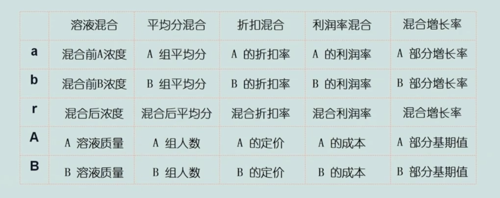

- [一、数量关系](#一数量关系)
  - [1. 十字交叉法：](#1-十字交叉法)
  - [2. 选项特征：](#2-选项特征)
  - [3. 倍数特性](#3-倍数特性)
  - [4. 奇偶特性](#4-奇偶特性)
  - [5. 行程问题](#5-行程问题)

广东事业单位考试近三年的题型题量如下：

易知课堂学习链接：https://user.yizhiknow.com/course/video/23156

# 一、数量关系

## 1. 十字交叉法：

如果将两种不同浓度的溶液混合在一起，则混合溶液的浓度一定是在这两种溶液的浓度之间的，所以可用以上线段法表示：a 代表第一种溶液的浓度，b 代表第二种溶液的浓度，r 代表混合溶液的浓度，将第一种溶液的浓度以及第二种溶液的浓度分别与混合溶液的浓度做差，然后再交叉写，得到的比例就是第一种溶液的质量与第二种溶液的质量比。

**解析：**由于甲溶液、乙溶液以及混合溶液的浓度都知道了，用线段法可得到，甲溶液和乙溶液的质量比为 1 : 2，又因为甲溶液的质量为 40kg，所以乙溶液的质量为 80kg，所以答案选择 **D**。

**解析：**由于甲溶液、乙溶液以及混合溶液的浓度都知道了，用线段法可得到，甲溶液和乙溶液的质量比为 2 : 3，又因为混合溶液的质量为 500g，所以甲溶液的质量为：500g * 2/5 = 200g，乙溶液的质量为：500g * 3/5 = 300g，所以答案选择 **D**。

**【注意】**十字交叉法不仅适用于溶液混合，也适用于平均分混合、体重混合等其他题型，如下所示：

所以只要题目符合上表所示的混合类型，都可以使用十字交叉法解题。

**解析：**这道题目属于体重混合的类型，同样可以使用十字交叉法解题，由于男、女的平均体重以及全体男女的平均体重都知道了，所以使用十字交叉法可以得到男女的人数比为 2 : 5，所以答案选择 **A**。

**解析：**由题目可得，优秀职工就代表 A，其他职工就代表 B，全部职工的平均分数也知道了，所以使用十字交叉法可以得到优秀职工和其他职工的人数比为 5 : 7，所以优秀职工的人数为：72 * 5/12 = 30（人），或者也可以使用倍数特性直接得出答案，因为优秀职工和其他职工的人数比为 5 : 7，那么优秀职工的人数肯定是 5 的倍数，选项中只有 30 是 5 的倍数，所以答案选择的是 **C**。

## 2. 选项特征：

​		善于利用**选项特征**秒题——有逻辑的“**蒙题大法**”：在公务员考试数量关系中，我们经常可以通过分析选项特征，结合出题人设置选项的意图，对出题人进行“反套路”，从而可以秒杀答案。

**选项特征秒杀法：题干见倍数，选项找倍数，题干见和差，选项找和差**

**解析：**就是利用题干信息体现出来的**倍数关系**或者**和差关系**快速得出答案，例如：在题目中找有没有体现出倍数关系的，如果有，则到选项中找有相应倍数关系的选项，这样就可以排除掉没有倍数关系的其他两个选项，然后再看题目问的问题，从而可以知道是选数值大的那一个还是数值小的那一个。同理，和差关系也是一样。

**解析：**从题干可以知道，B 种酒的酒精浓度是 A 种酒的一半，这体现出了一个**倍数**关系，所以就到选项中找有两倍关系的选项，发现：A 和 D 选项体现出了两倍关系，所以答案一定是在 A 和 D 选项中，此时只需判断 A 种酒的浓度是高的那一个还是低的那一个就可以了。从“B 种酒的酒精浓度是 A 种酒的一半”这句话可以知道，A 种酒的浓度更高，所以答案就选择 **A**。

**解析：**从题干可以知道，乙车的速度是甲车的 2 倍，这体现出了一个**倍数**关系，所以就到选项中找有两倍关系的选项，发现：A 和 D 选项体现出了两倍关系，所以答案一定是在 A 和 D 选项中，此时只需判断甲车的速度是快的那一个还是慢的那一个就可以了。由于乙车的速度是甲车的 2 倍，所以可以知道，甲车的速度是慢的那一个，所以答案就选择 **A**。

**解析：**从题干可以知道，绿色瓷砖和白色瓷砖一共有 400 块，有体现出**和**的关系，所以就到选项中找和为 400 的选项，可以发现：A 和 D 选项加起来一共就是 400，所以答案一定是在 A 和 D 选项中，此时只需判断绿色瓷砖的数量是多的那一个还是少的那一个就可以了。因为最外面的一周是用绿色瓷砖铺的，所以绿色瓷砖的数量更多，所以答案就选择 **D**。

## 3. 倍数特性

可以记住以上的数字规律，善于利用倍数特性秒题：

**解析：**因为哥哥的书是弟弟的 4 倍，出现了比例，所以可以利用倍数特性解题，由哥哥的书是弟弟的 4 倍可知，哥哥的书与弟弟的书的数量比例为 4 : 1，由比例可以看成，哥哥占 4 份，弟弟占 1 份，所以一共就占 5 份，所以哥哥和弟弟加起来的书的数量一定是 5 的倍数，所以答案选择的是 **A**。

**解析：**因为甲、乙工作效率之比为 7 : 3，出现了比例，所以可以利用倍数特性解题，题目问的是甲每天做了多少个，所以答案肯定是 7 的倍数，所以答案就选择 **C**。

**解析：**由 “如果每天做50道题，那么最后2天每天要做85道题才能完成” 这句话可以设需要 x 天才能做完，由此可以得出：总题数 = 50x + 2 * 85，所以：总题数 - 170 = 50x，即：总题数减去170就是50的倍数，所以将每个选项都减去 170 看看哪个选项才是 50 的倍数，减完可以知道选择的是 **C**。每个选项都减去 170 比较麻烦，也可以根据上面的倍数判定可以知道，如果要满足 5 的倍数，则个位必须是以 0 或 5 结尾的，所以如果要满足 50 的倍数，则必须是以 00 或 50 结尾的，所以就可以知道，总题数 - 170 要以 00 或 50 结尾的，所以总题数就必须以 70 结尾或者 20 结尾的，所以这样也可以知道答案选择的是 **C**。

**解析：**由 “如果每辆车坐20人，还剩下2名员工”这句话可以设一共需要坐 x 辆车，由此可以得出：总人数 = 20x + 2， 则：总人数 - 2 = 20x，即：总人数减 2 就是 20 的倍数，所以将每个选项减去 2 可以知道答案就是 **B** 选项。

## 4. 奇偶特性

不定方程：有 2 个未知数，但列出的只有一个方程，就是不定方程，虽然列出来的方程有多个未知数，但可以利用未知数的奇偶性判断出来答案的奇偶性。

**解析：**设红色文件袋的数量为 x 个，蓝色文件袋的数量为 y 个，则可以列出方程：7x + 4y = 29，有 2 个未知数，但列出的只有一个方程，所以这就是一个不定方程。因为 29 为奇数，4y 是偶数，所以 7x 肯定是奇数，又因为两数相乘才为奇，所以 x 肯定是奇数，所以红色文件袋的数量一定是奇数，因此答案就选择 **C**。

**解析：**设购买苹果 x 个，购买火龙果 y 个，则可以列出方程：5x + 3y = 61，有 2 个未知数，但列出的只有一个方程，所以这就是一个不定方程。因为现在只知道 61 是奇数而已，无法判定 5x 和 3y 的奇偶性，此时就需要对方程变形一下，让方程的其中两项可以判定奇偶性，5x + 3y = 61 可以化为 2x + 3x + 3y = 61，即：2x + 3(x + y) = 61，因为 61 是奇数，2x 是偶数，所以 3(x + y) 是奇数，又因为两数相乘才为奇，所以 x + y 一定是奇数，因为 x + y 就是这两种水果的总数，所以答案就是 A 或 D 选项，因为题目说最多可购买这两种水果多少个，所以选择19，答案选 **D**。

**解析：**设第一个部门的人数为 x 个，第二个部门的人数为 y 个，第三个部门的人数为 z 个，因为第一个部门的人数是其他两个部门人数的 1/3 ，所以：3x = y + z，所以三个部门的总人数 = x + y + z = x + 3x = 4x，所以 x + y + 35 = 4x，因为 4x 为偶数，35 为奇数，又因为两奇相加必为偶，所以 x + y 是奇数，所以 x - y 也是奇数 ，因为 x - y 就是第一个部门和第二个部门的人数差，所以答案就选择 **B**。

## 5. 行程问题

由公式 s = vt 可以知道：时间相同，路程跟速度成正比，速度相同，路程跟时间成正比，路程相同，速度跟时间成反比。

行程的相遇问题：

（1）**单岸型的相遇问题：**两车都是从两地匀速相向行驶，经过了两次相遇，两次相遇都说明了距离同一个地方多少千米，这就是单岸型的相遇问题。

（2）**双岸型的相遇问题：**两车都是从两地匀速相向行驶，经过了两次相遇，第一次相遇说明了距离一个地方多少千米，第二次相遇说明了距离另一个地方多少千米，这就是双岸型的相遇问题。

**下面先看单岸型的相遇问题的公式推导过程：**

在第一次相遇的地点时，设总路程为S，A地距离第一次相遇地点的路程为S1，则B地距离第一次相遇地点的路程为 S - S1，所以在第一次相遇时，甲车走过的路程就是S1，乙车走过的路程就是S-S1，在第二次相遇的地点时，设总路程为S，A地距离第二次相遇地点的路程为 S2 ，则B地距离第二次相遇地点的路程为 S - S2，所以在第二次相遇时，甲车走过的路程就是S+(S-S2)=2S-S2，乙车走过的路程就是S+S2，红色线表示甲车走过的路程，黄色线表示乙车走过的路程，所以由上图可以得到：S1/(S-S1) = (2S-S2)/(S+S2)，所以就可以得到上面的单岸型公式了。

例题演示：

**解析：**由题目可知这是单岸型的相遇问题，直接套用公式即可：S = (3*100 + 80) / 2 = 190，所以答案选 **C**。

**解析：**由题目可知这是单岸型的相遇问题，直接套用公式即可：S = (3*100 + 180) / 2 = 240，所以答案选 **B**。

**解析：**由题目可知这也是单岸型的相遇问题，直接套用公式即可：S = (3*80 + 60) / 2 = 150，所以答案选 **B**。

**下面再看双岸型的相遇问题的公式推导过程：**

在第一次相遇的地点时，设总路程为S，A地距离第一次相遇地点的路程为S1，则B地距离第一次相遇地点的路程为 S - S1，所以在第一次相遇时，甲车走过的路程就是S1，乙车走过的路程就是S-S1，在第二次相遇的地点时，设总路程为S，B地距离第二次相遇地点的路程为 S2 ，则A地距离第二次相遇地点的路程为 S - S2，所以在第二次相遇时，甲车走过的路程就是S+S2，乙车走过的路程就是S+(S-S2)=2S-S2，红色线表示甲车走过的路程，黄色线表示乙车走过的路程，所以由上图可以得到：S1/(S-S1) = (S+S2) / (2S-S2)，所以就可以得到上面的双岸型公式了。

**解析：**由题目可知这是双岸型的相遇问题，直接套用公式即可：S = 3*35 - 25 = 80，所以答案选 **A**。

**解析：**由题目可知这是双岸型的相遇问题，直接套用公式即可：S = 3*15 - 8 = 37，所以答案选 **B**。

**解析：**由题目可知这也是双岸型的相遇问题，直接套用公式即可：S = 3*95 - 25 = 260，所以答案选 **C**。

# 6. 日期问题（一）

**【题型】已知某年的某天是星期几，问另一年份的某天是星期几**

**口诀解析：口诀分为三步骤，将每一步得到的数累加即可**

（1）**一年加1** ：意思是看两个不同的年份相差多少年，然后就加几。例如：2008年到2010年相差了两年，所以就加2；

（2）**闰年再加1 ：意思是在两个不同的年份中，看期间过了多少次闰年，然后就加几。判断过了多少次闰年的方法就是：由于闰年和平年的差别就是闰年的2月份会有29日，而平年的2月份只有28日，所以**闰年比平年多出的那一天就是2月29日**，所以只需要看在两个不同的年份期间，过了多少个闰年的2月29日，然后就加几即可。例如：2008年的元旦到2009年的元旦期间，由于2008年是闰年，且2008年的元旦到2009年的元旦期间过了2008年闰年的2月29日，所以就加1；

（3）**日期要关注**：就是要看问的日期和另一个日期比较，是往回推了还是往后推了，如果是往回推了就减，如果是往后推了就加，如果问的是不同年份的同一天，则不需要加减。

 

解析：如果是平年，需要加上一天，如果又是闰年，则需要再加上一天。由于闰年和平年的差别就是闰年的2月份会有29日，而平年的2月份只有28日，所以闰年比平年多出的那一天就是2月29日

**解析：**第一步，看两个不同的年份相差了多少年，2008年到2009年相差了1年，所以先加1；第二步，在两个不同的年份中，看期间出现过多少次闰年，2008年的元旦到2009年的元旦期间，过了2008年闰年的2月29日，所以再加1；第三步，比较题目出现的两个日期，由于题目问的都是元旦（同一天），所以不需要加减，因此一共增加了2天。又因为2008年的元旦是星期二，所以就在星期二的基础上加上2天，所以答案就是星期四，选 **C**。

**解析：**第一步，看两个不同的年份相差了多少年，2003年到2005年相差了2年，所以先加2；第二步，在两个不同的年份中，看期间出现过多少次闰年，2003年到2005年期间，由于2004年是闰年，所以在2003年7月3日到2005年7月1日期间，过了2004闰年的2月29日，所以再加1；第三步，比较题目出现的两个日期，由于题目问的是7月1日，和7月3日相比，少了2天，即往回推了2天，所以需要减2，因此一共增加了 2+1-2 = 1 天。又因为2003年的7月3日是星期二，所以就在星期二的基础上加上1天，所以答案就是星期三，选 **A**。

**解析：**第一步，看两个不同的年份相差了多少年，2015年到2017年相差了2年，所以先加2；第二步，在两个不同的年份中，看期间出现过多少次闰年，由于2016年是闰年，所以2015年3月5日到2017年3月7日期间，过了2016年的2月29日，所以再加1；第三步，比较题目出现的两个日期，由于题目问的是3月7日，和3月5日相比，多了2天，即往后推了2天，所以需要加2，因此一共增加了 2+1+2 = 5 天。又因为2015年的3月5日是星期天，所以就在星期天的基础上加上5天，所以答案就是星期五，选 **D**。

**解析：**第一步，看两个不同的年份相差了多少年，2015年到2016年相差了1年，所以先加1；第二步，在两个不同的年份中，看期间出现过多少次闰年，由于在2015年2月7日到2016年2月7日期间，还没过到2016年2月29日，所以还没过到闰年，不需要加；第三步，比较题目出现的两个日期，由于题目问的都是2月7日（同一天），所以也不需要加减，因此一共增加了 1+0+0 = 1 天。又因为2015年的2月7日是星期天，所以就在星期天的基础上加上1天，所以答案就是星期一，选 **A**。

# 7. 日期问题（二）

看以下大月和小月的规律：**大月前三后三、小月前二后二**

**原理解析：**对于大月而言，一个月会有31天，所以除以一个星期7天之后，得到大月会有4个星期余3天。由于每个星期都是循环的，所以最后那3天肯定是和前3天的星期数是一致的。同理，对于小月而言，一个月会有30天，所以除以一个星期7天之后，得到小月会有4个星期余2天。由于每个星期都是循环的，所以最后那2天肯定是和前2天的星期数是一致的。

**解析：**由于9月份是小月，有30天，又因为9月份有21个工作日，所以9月份的节假日有 30 - 21 = 9（天），又因为国务院办公厅肯定是双休的，所以9月份会有4个周六日一起休，一共8天，但9月的节假日还剩下一天，多出的这一天肯定是在月头或者月尾，所以可以推出这一天可能是9月1日的星期天，或者是9月30日的星期六，所以可以先排除 A 和 C 选项。因为已经推出9月30日是星期六，所以9月29日是星期五，由**小月前二后二**口诀可知，9月1日和9月29日的星期数一致，所以9月1日也是星期五，所以答案就选 **B**。

**解析：**由于8月份是大月，有31天，又因为8月份有22个工作日，所以8月份的节假日有 31 - 22 = 9（天），又因为国务院办公厅肯定是双休的，所以8月份会有4个周六日一起休，一共8天，但8月的节假日还剩下一天，多出的这一天肯定是在月头或者月尾，所以可以推出这一天可能是8月1日的星期天，或者是8月31日的星期六，所以可以先排除 A 和 C 选项。因为已经推出8月31日是星期六，所以8月30日是星期五，8月29日是星期四，由**大月前三后三**口诀可知，8月1日和8月29日的星期数一致，所以8月1日也是星期四，所以答案就选 **D**。